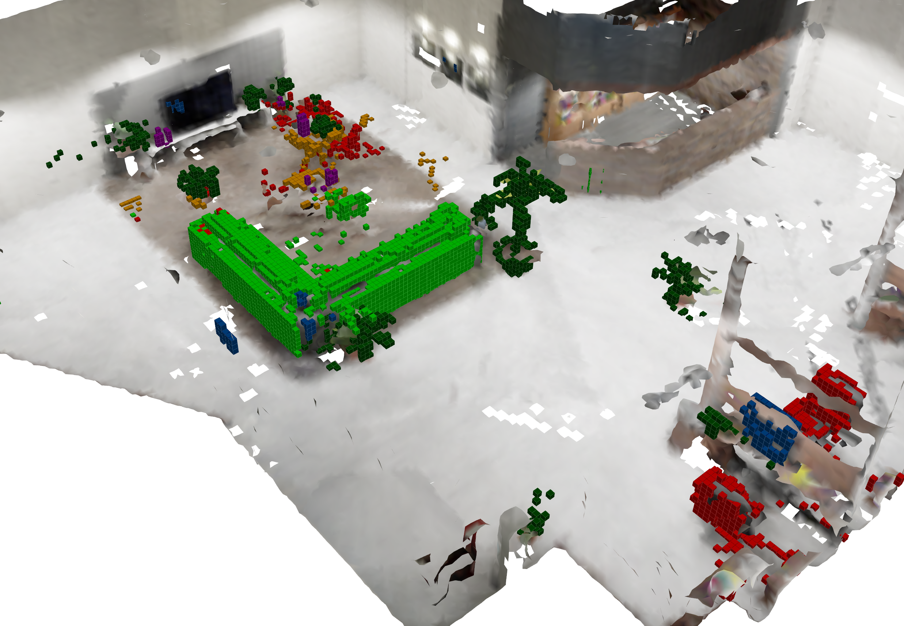

# Semantic Mapping

This repository contains the code for a simple voxel-hashing semantic map.
It includes the data structure for the map, several fusion methods for the voxels,
evaluation procedures and a script to evaluate maps. The mapping system is intended to
be used by the integrated ROS node or by including it as a library as in the case of [ipp_tools](https://github.com/dvdmc/ipp_tools).


<p float="center" align="middle">
  
  <p align="middle">Note: this image shows a semantic map overlayed on a Voxblox map.</p>
</p>

## Installation

Clone the repository with:

```
git clone https://github.com/dvdmc/sensors_tools
```

Download the `Cereal` library for serialization and place into the `semantic_mapping/include/` folder.
Then, copy the file `semantic_mapping/mods/eigen.hpp` into `semantic_mapping/include/cereal/types/` for serializing Eigen types.
Place the package inside a ROS `catkin_ws/src` and compile using:

```
catkin build semantic_mapping semantic_mapping_ros
```

## Structure
- `semantic_mapping/`: where the data structure and the integrators are defined. Most of the code except the `MapEvaluator` is header only. 
- `semantic_mapping_ros/`: ROS package including all the interfaces and fusion method. It is the intended way of using the standalone map within ROS.

## Configuration

For the configuration, the map and fusion pipelines are loaded with different options. You can check the configuration files in the ROS package for more details.
The ROS node shows how the parameters are used to configure different modules and controlling the mapping algorithm.

## Usage

The intended usage is by running the `sensor` node with `rosrun` or using a launch file:

```
roslaunch semantic_mapping_ros semanic_map.launch
```
